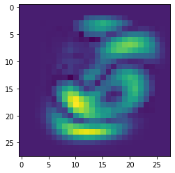

# MWU-Boosting

This repository presents an implementation of the boosting algorithm based on the Multiplicative Weights Update.

It was developed for an assignment for the Algorithms and Uncertainty course @ PUC-Rio (2022.2). 

### Goal

The goal of the project is to classify/distinguish a pair of digits in the 28x28 MNIST dataset. For example, if we chose the classes "5" and "6", our goal is to correctly classify the instances of those classes in the test dataset.   

### Description

For the implementation of this assignment, we had two main steps. 

#### Single-pixel classifiers

In order to evaluate the boosting algorithm in action, we first train single-pixel classifers for each pixel of the 28x28 the image. Thus, we train 784 classifiers that only receive the information of a single pixel of each of the images of the train dataset (classifier _i_ will be trained with the pixel _i_ of every image in the train dataset). 

Since very little information is provided, many single-pixel classifiers will have close to 0.5 accuracies, while a few classifiers that see relevant pixels may have a better accuracy.

The dispersion of accuracies among the pixels can be seen in the image below.

  

#### The MWU-Boosting

Having trained the single-pixel classifiers, we use the boosting algorithm following the Multiplicative Weight Update method to create a better combined classifier. 

Without getting into much details, at each iteration the algorithm finds a gamma-weak classifier for an distribution _p_ over the training data. After that, we update an reward array _r_ with a value _r(i) = 1_ if the sample _i_ was misslabeled by the classifier, and _r(i) = 0_ otherwhise. Finally, we send the reward array _r_ to the MWU algorithm to get a new distribution _p_.

This process happens until a defined time _T_ or until there are no more gamma-weak classifiers for the distribution _p_.

The accuracy of the combined classifier at each iteraction of the boosting algorithm is displayed in the image below.

  

In our experiment, the boosted classifier got a final accuracy of 0.962, while the best single-pixel classifier had a 0.864 accuracy. 

